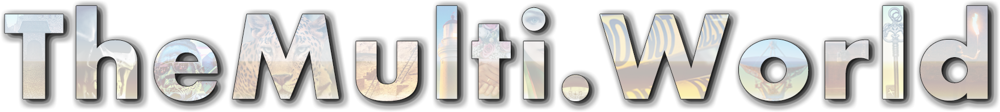

  

  ### Create your world.

## What is the MultiWorld?

The MultiWorld is a MUD/MUX like environment rebuilt from the ground up for the modern web.  It will be designed to allow users to create their own world, linked to a main hub for all worlds for people to explore. It will feature:

- React Based front end
  - UI editor for world creations
    - Spaces, Places, Objects, Scripts
      - Public domain image search
        - [unsplash implementation](https://github.com/jtrachtenberg/unsplash)
      - User image upload
    - Scene editor - NPC specific scripting
- [Express based backend](https://github.com/jtrachtenberg/themultiworld)
  - RESTful API for public stats / fan pages
- Sockets.io implementation for realtime updates
  - Multi-user environment
  - 1-1 and many-many chat enviornments
- Economy
  - Implementation allowing payments between users
- Security
  - While every user will be required to create at least a minimal public world (A root space containing a root place), individual places or entire spaces can require keys

This project was bootstrapped with [Create React App](https://github.com/facebook/create-react-app).

